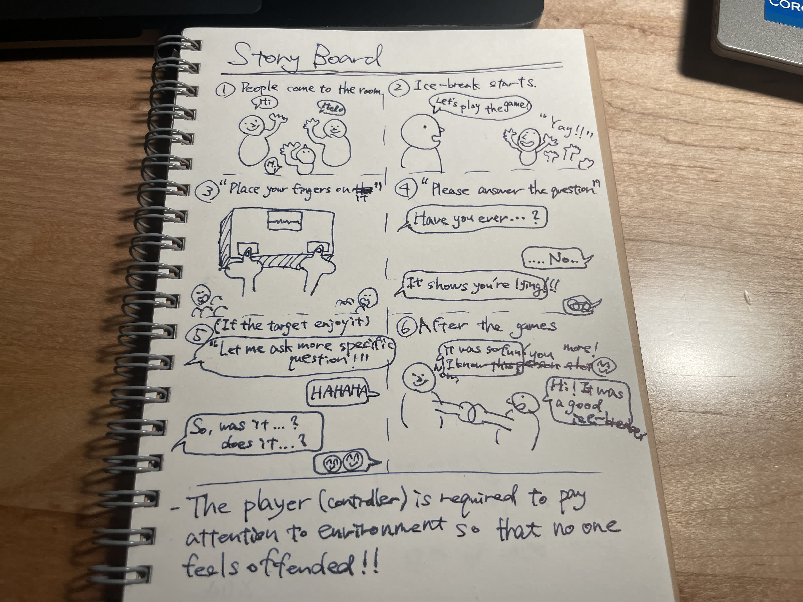
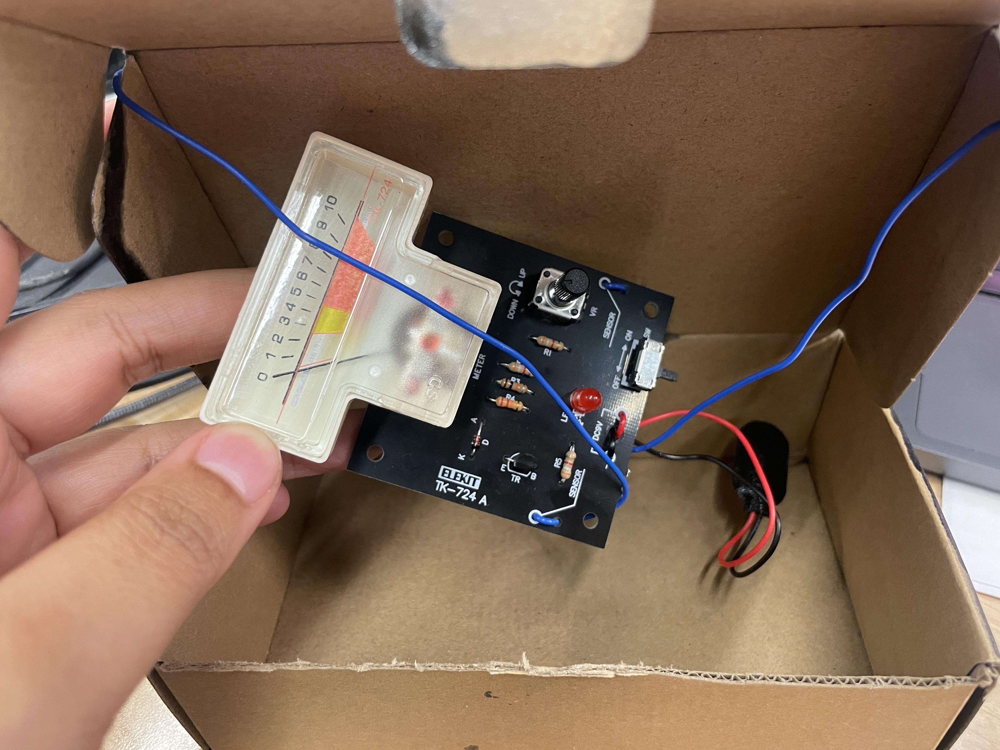
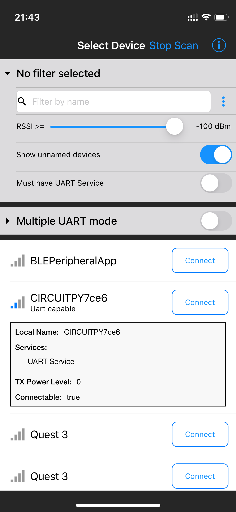
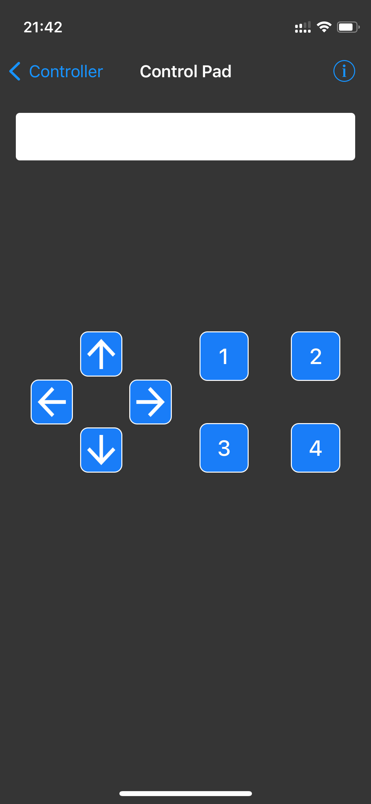
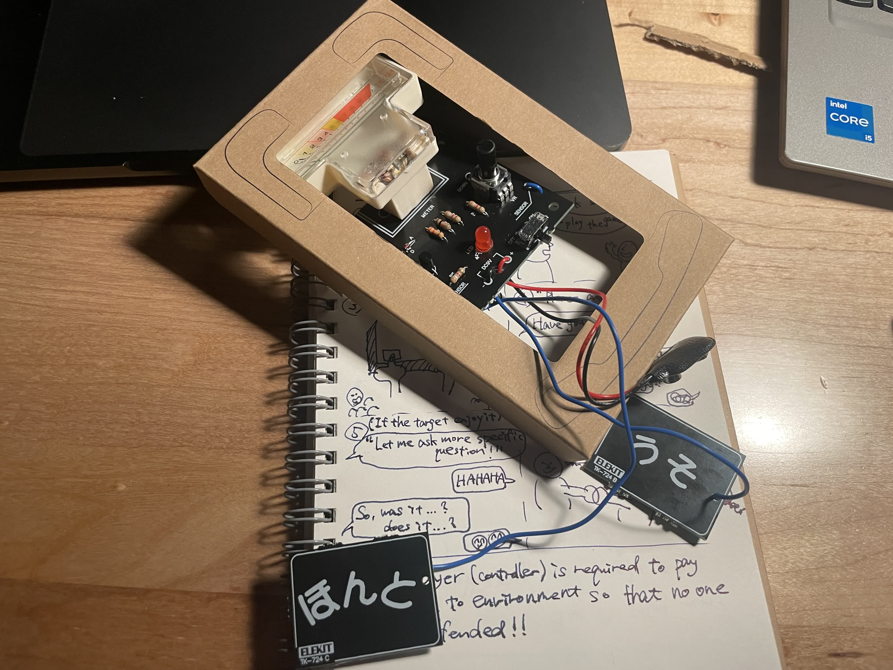
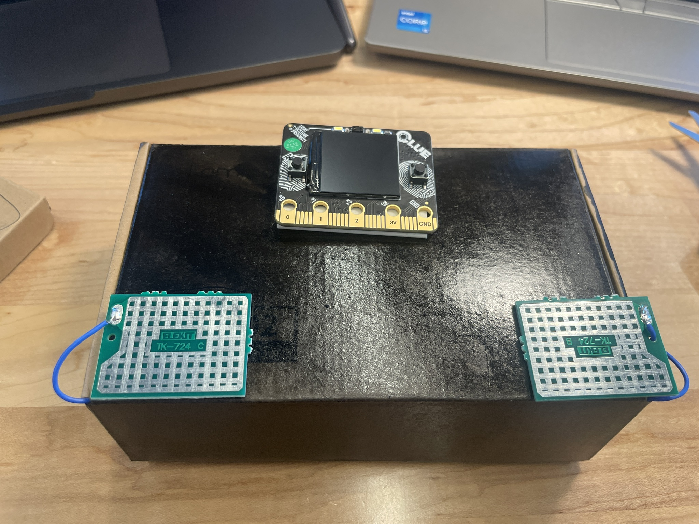

# Assignment 2
## Deliverables

1. Assignment writeup: prepare a short 500~750 word description of your interactive device. Make sure to describe the setting, players, activity and goals as described above.

- Setting: Where-> in a room, When-> friends want to have some fun (anytime)

- Players: Who is involved in the interaction?-> the target and the player,  Who else is there?-> maybe some other friends, 

- Activity: What is happening between the player(s) and the device?-> they controle people by controlling device

Goals: What are the goals of the player(s)?-> make the atmosphere more fun, casual and warmth.

   
2. Storyboards:
   
   
3. Photo of the device and video of the interaction: Document both the device and the interaction: at a minimum, your video should show one partner interacting with the device and showing some of the interactions from the storyboards. You may also want to show the wizard interface driving the device, if you have done anything particularly interesting or unique with it.

**Hardware**
This is the device "The Lie Ditector". It is made with cardboard and I spray-painted it into Black. There are 3 parts on top of this box:
- The monitor: This is a [Clue Board](https://www.adafruit.com/product/4500). The Li-battery located inside box is connected.
- Touch sensor (Left and Right): this is where a user put their finger on. This is originally a part of the [physical lie ditector](https://www.elekit.co.jp/product/TK-724R)---the eletronics kit for bigginer. I only use the touch sensor as a WoZ part, nothing is working in this sensor.

**Software**
I borrowed the code from [PyLeap CLUE Sensor Plotter](https://learn.adafruit.com/pyleap-clue-sensor-plotter). I use humidity sensor for display the plot. If you press the button on the app, you can controll the plot.

