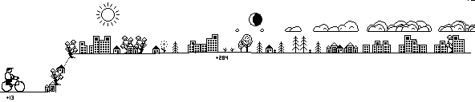

# The Project Proposal
For this assignment, you will need to prepare a written project proposal for the final project. The proposal is very important, in order to determine whether the project is in scope: both doable in the time we have, and still big enough for a final project. It helps you get off to a good start and to find an idea your group believes in and that is likely to lead to a successful project.

It will also serve as a blueprint for your presentation of the proposal, which you will do in class on March 19.

The written proposal will define your group’s plan to design and/or evaluate a technology, and should include:

1. **What and Why**: What problem are you trying to solve? Why should anyone care? or in other words, why is it important to solve the problem? You need to include an explicit description of the impact, contribution and benefits of the proposed project.
   
2. **How**: How are you planning to solve the problem? Please do a small literature review to summarize the state-of-the-art solutions or studies that have been proposed or conducted by other researchers or companies in this area, and then present your logic and arguments to show that your solution could be a better solution.
   
3. **Technical Details**: What are the specific challenges you plan to tackle and how? Give the most important technical details. For example: What sensors are you going to use? What techniques are you going to use to gain insights from the data? What wearable or ubiquitous computing platforms are you going to build on?
   
4. **Evaluation Plan**: Your project will have to be useful for an audience beyond just you. Include a plan for how you will put it in front of others and evaluate or measure its success. Who are your users, and how will you find them? What data will you collect, and for how long? What will you measure from the data you collect, and how will you evaluate the performance of the system (e.g., accuracy, precision, recall, …)? How will you evaluate the effectiveness of the technology in the real world (e.g., wearability, ease of use, adoption by users, potential for long-term impact)?
   
5. **Project Plan and Timeline**: What is your project plan? Include a timeline with major milestones for completing your project, and what each person in the group will do. Major milestones include getting any hardware and software you may need, writing code, building hardware, conducting a usability study, and writing up the results. If you are designing any custom fabricated parts, especially parts with lead times like printed circuit boards, plan a deadline for both a first and a second revision! 
Based on prior experience, it is likely that many groups will be asked to revise and resubmit their proposal with a smaller scope and more detail. This is a normal thing for projects in this class, for papers submitted to conferences and for products trying to take on the world. Don’t worry if this happens to you (but think about an appropriate scope, neither too big nor too small). 

Every good project can provide convincing responses to Heilmeier’s Catechism well. See the Wikipedia entryLinks to an external site..

- What are you trying to do? Articulate your objectives using absolutely no jargon.
- How is it done today, and what are the limits of current practice?
- What's new in your approach and why do you think it will be successful?
- Who cares? If you're successful, what difference will it make?
- What are the risks and the payoffs?
- How much will it cost?
- How long will it take?
- What are the midterm and final "exams" to check for success?

**Format**: Please try to be as concise as possible. Please try to limit the project proposal to 2 pages (without references). 

**Pitch**
Hi! I'm planning to create a **bike trip summarizer!**
- This device will **monitor GPS, speed, temperature, how shaky it was, and photos** during your ride and, based on this data, will **summarize your entire trip** and generate a poetic sentence, like for a blog or dairy.
- Additionally, the device is **connected to a button on the handlebar**, which allows you to **mark highlight moments** of your ride (similar to a camera shutter button).
- So, the **input** will include GPS data, temperature, speed, and the highlight-marking button(camera), and the **output** will be a generated text summary.
- I **borrowed some inspiration from the "Poetry Camera"** obviously, but my research focuses on **micromobility**—how people use it and what we can do to make it **safer and more user-friendly**. One key trait from our study was **how dangerous it is to use a phone while riding**.
- So, instead of **taking photos with a phone during a ride**, I propose **installing a single button on the handlebar** that is **easily accessible**, along with a system that **automatically summarizes your bike trip!** 🚴✨

- Using camera might be useful to capture the moment
- Microcontroller board might be better for power consumption
- CLUE board, ESP32 with a camera! -> adafruit memento
- https://github.com/lds133/weather_landscape?tab=readme-ov-file

